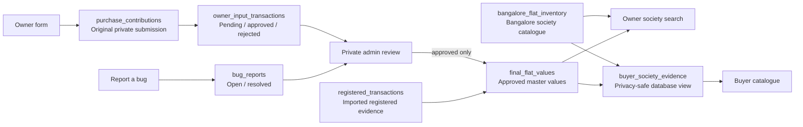

# FlatData database guide

Last updated: 3 September 2026

This document explains how FlatData stores the Bangalore society inventory,
registered transactions, owner-submitted prices, approved master values, and
bug reports. It is written as a durable reference for future product and
engineering work.

## Core rule

The four datasets have different jobs and must remain separate:

1. `bangalore_flat_inventory` is the searchable catalogue of Bangalore gated
   societies. It is not a transaction table.
2. `registered_transactions` stores imported registered transaction evidence.
3. `owner_input_transactions` stores every owner price submission, including
   pending and rejected submissions.
4. `final_flat_values` is the approved master value table. Registered evidence
   may be loaded into it, but an owner submission enters it only after an admin
   approves that submission.

Do not purge one table into another, replace one with another, or treat the
inventory as proof that a valuation exists.

## Data flow

## Society search

The owner form searches a combined list from:

- every active row in `bangalore_flat_inventory`; and
- each distinct society and location in `final_flat_values` that does not
  already have an active inventory match.

The normal match is a case-insensitive comparison of trimmed society name and
location. `flat_inventory_id` is preferred when it exists because it is the
stable link between the catalogue and other tables.

An inventory society is marked as having valuation evidence when a row in
`final_flat_values` points to its `flat_inventory_id`, or when the master row's
trimmed society and location match it. A society with no matching master value
can still be selected and submitted, but the owner sees an acknowledgement
instead of an empty valuation.

## Buyer catalogue and owner-price privacy

The Buyer catalogue is not maintained as a separate handwritten list. It reads
`buyer_society_evidence`, a database view (a saved read-only query) built from:

- every active society in `bangalore_flat_inventory`;
- unmatched society and location pairs retained in `final_flat_values`; and
- approved registered and owner evidence in `final_flat_values`.

This means a newly added inventory society can appear in Buyer search even when
it has no price evidence. Its card shows that evidence is not yet available.

Individual owner prices are never returned to the Buyer page. Owner evidence is
grouped by society and BHK inside the database view. The view exposes an owner
median and range only when at least three approved owner records exist for the
same society and BHK. With one or two approvals, the view exposes only the
number of approved inputs and returns null for every owner-derived price and
date. BHK-specific rows are also withheld below this threshold.

When registered and anonymous owner evidence both exist, the Buyer benchmark
uses the registered median as the primary price. The owner median remains a
separate supporting signal, and the source is labelled `combined`.

## Table reference

### `bangalore_flat_inventory`

Purpose: the separate, searchable Bangalore gated-society catalogue.

| Column | Meaning |
| --- | --- |
| `id` | Stable text primary key used by linked tables. |
| `name` | Display name of the society or apartment project. |
| `name_key` | Normalized name used for matching and deduplication. |
| `area` | Display area or locality. |
| `area_key` | Normalized area used for matching and deduplication. |
| `builder` | Builder or developer name from the inventory source. |
| `source_url` | Optional source page for the inventory record. |
| `source_file` | File or import source that produced the record. |
| `active` | Whether the society is currently available in search. |
| `imported_at` | First import time. |
| `updated_at` | Last inventory update time. |

Important rule: `(name_key, area_key)` is unique. Deactivate a superseded row
instead of deleting history that may already be referenced.

### `registered_transactions`

Purpose: imported registered-sale evidence. This table remains independent of
owner input.

Important columns include `id`, `flat_inventory_id`, `society`, `location`,
`tower`, `bhk`, `registration_date`, `price`, `effective_area`,
`price_per_sq_ft`, `area_basis`, `sale_type`, `qa_notes`, `source_file`, and
`source_url`.

`flat_inventory_id` is nullable because older or unmatched transaction records
can still be retained. When a reliable catalogue match is found, it should be
filled without changing the original society and location text.

### `owner_properties`

Purpose: private property details attached to an owner contribution.

It stores the contributor link, optional `flat_inventory_id`, canonical society
and location, tower or block, floor, BHK, area, area type, purchase date, and
legacy property fields.

`car_parks` remains in the database for backward compatibility. The owner form
stopped collecting it on 3 September 2026, so new submissions write `0`, which
means “not collected”, not “the flat has no parking”.

### `purchase_contributions`

Purpose: the original private owner submission and its admin-review state.

`request_id` is unique and makes a retried browser request safe: the same form
submission is not inserted twice. `status` is `pending`, `approved`, or
`rejected`. Review time, reviewer, and notes are retained.

The owner form changed to one all-inclusive purchase price on 3 September 2026.
New records put that full amount in `purchase_price` and write `0` to the legacy
`stamp_duty` and `registration_cost` columns. Those columns remain so older
records and older code can still be understood. Do not add the legacy columns
to a new record's purchase price again, or costs will be counted twice.

### `owner_input_transactions`

Purpose: the permanent queue and history of owner-supplied price evidence.

Every successfully saved owner contribution must have one row here, regardless
of whether it is pending, approved, or rejected. `contribution_id` is unique.
The table stores the optional inventory link, canonical society and location,
all-inclusive purchase price, effective area, calculated price per square foot,
BHK, purchase date, status, submission time, and review fields.

This is the table to inspect when asking, “What did owners submit?” It must not
be replaced by `final_flat_values`, because rejected and pending evidence must
remain auditable without affecting valuations.

### `final_flat_values`

Purpose: the approved master value table intended to drive flat valuations.

`source_type` records whether a row came from `registered_transaction` or
`owner_input`. Exactly one matching source link must be populated:

- a registered row requires `registered_transaction_id` and no
  `owner_input_transaction_id`;
- an owner row requires `owner_input_transaction_id`, no
  `registered_transaction_id`, and a non-null `approved_at`.

The unique source indexes prevent the same registered transaction or owner
input from entering the master table twice. `approved_by` and `approved_at`
preserve the decision trail for owner evidence.

The application must never insert pending or rejected owner input into this
table. Approval updates `owner_input_transactions` and creates the master row
in the same database transaction, so they either both succeed or neither does.

### `buyer_society_evidence`

Purpose: provide the complete Buyer society catalogue and privacy-safe price
summaries without copying or exposing raw owner records.

This is a live database view, not another stored transaction table. It returns
one all-BHK summary per society and additional BHK rows only when registered
evidence exists or the owner anonymity threshold has been met.

Important columns include `catalogue_id`, `flat_inventory_id`, `society`,
`location`, `builder`, `bhk`, `registered_count`, `approved_owner_count`,
`public_owner_count`, separate registered and owner medians, the owner range,
latest eligible evidence dates, and `evidence_source`.

Allowed `evidence_source` values are:

- `none`: no public price evidence; private owner evidence may still be building;
- `registered_transaction`: registered evidence only;
- `owner_input`: an anonymous owner cohort only; and
- `combined`: registered evidence plus an anonymous owner cohort.

### `bug_reports`

Purpose: track bug reports submitted from the owner page.

| Column | Meaning |
| --- | --- |
| `id` | UUID primary key. |
| `user_id` | Optional signed-in user link. |
| `reporter_email` | Optional email copied from the signed-in session. |
| `page_path` | App page on which the problem was reported. |
| `message` | User's bug description, limited to 2,000 characters by the API. |
| `status` | `open` or `resolved`. |
| `request_fingerprint` | One-way request fingerprint used only for rate limiting. |
| `created_at` | Submission time. |
| `resolved_at` | Resolution time. |
| `resolved_by` | Admin email that marked the report resolved. |

The private admin dashboard lists open reports and can mark them resolved. Raw
IP addresses are not stored.

## Supporting tables

- `contributors` links an authenticated user and email to private owner data.
- `owner_price_aggregates` contains privacy-safe approved owner ranges. Public
  owner evidence appears only after the configured minimum cohort is reached.
- `valuation_snapshots` records the algorithm version, evidence IDs, input
  snapshot, estimate, range, and confidence used for a private result.
- `registered_transaction_imports` and
  `registered_transaction_import_rows` stage workbook imports and preserve
  quality-review decisions before registered evidence is applied.
- `notification_deliveries` records approval or rejection email delivery.
- `app_users`, `user_sessions`, `user_otp_challenges`, and `user_consents`
  provide user sign-in, session, and consent history.
- `admin_sessions` and `admin_otp_challenges` provide private admin access.
- `share_records`, `product_events`, `society_price_subscriptions`, and
  `society_subscription_deliveries` support privacy-safe sharing and alerts.

## Privacy and review rules

1. A draft stays in the owner's browser until the owner verifies access and
   submits it.
2. The saved contribution and owner-input row are private.
3. A pending submission cannot affect `final_flat_values`.
4. An admin decision changes both the contribution and owner-input status.
5. Only approval inserts the owner evidence into `final_flat_values`.
6. Public owner ranges continue to require a minimum anonymous cohort; one
   owner's exact price must never be shown as a public comparable.
7. A rejected row remains in `owner_input_transactions` for audit history but
   is excluded from the master table and public aggregates.

## Migration and deployment notes

The repository uses Drizzle SQL migrations in `drizzle/` and applies pending
migrations with `npm run db:migrate:remote`. Migration `0012` adopts the three
flat-data tables that were already present in production and adds
`bug_reports`. Its table, column, constraint, and index operations are written
to be safe when the earlier flat tables already exist.

Migration `0013` adds the read-only `buyer_society_evidence` view. It does not
delete or rewrite inventory, registered transactions, owner inputs, or master
values.

Production is the Vercel project `truesquare`, with `flatdata.in` and
`www.flatdata.in` assigned to its production deployment. Apply a required
database migration before deploying application code that queries the new
table or view. After deployment, verify the owner page, one no-valuation
society, one valued society, one privacy-threshold society in Buyer search, the
bug-report API, and the private admin operations panel.

Never put database passwords, authentication secrets, or complete connection
URLs in this document or in source control.
